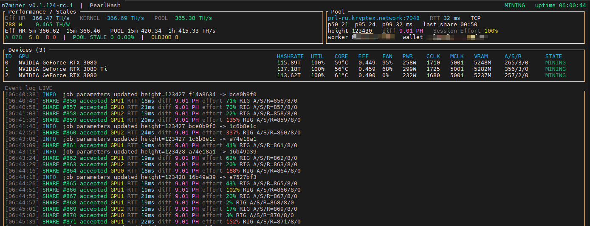
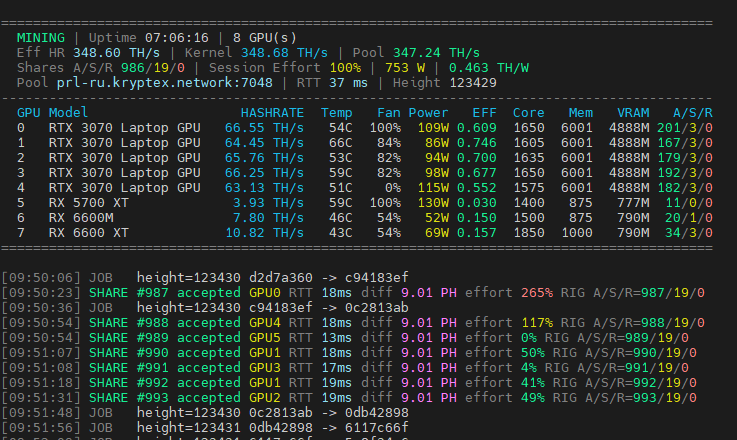

# N7Miner

**High-performance PearlHash GPU miner for NVIDIA and AMD GPUs**

N7Miner is a GPU miner focused on high performance, efficiency, stable pool operation and practical multi-GPU mining.

**Windows · Linux · HiveOS**  
**NVIDIA + AMD**  
**Developer fee: 2%**

> N7Miner is distributed as prebuilt binaries.  
> Source code is not publicly available.

---

## Preview



> **Note:** `Eff HR` needs approximately **10–15 minutes** of continuous mining to reach a representative value.

### Console mode



Use:

```bash
--notui
```

Example:

```bash
n7miner --notui --log-interval 180
```

---

## Features

- PearlHash mining
- NVIDIA and AMD GPU support
- mixed NVIDIA + AMD rigs
- multi-GPU mining
- Windows, Linux and HiveOS
- interactive TUI
- lightweight scrolling console mode
- automatic GPU/runtime selection
- per-GPU hashrate and telemetry
- pool hashrate tracking
- session effort tracking
- pool failover support
- GPU core and memory clock control
- per-GPU clock values
- clock restoration on miner exit
- accepted / rejected / stale share tracking
- built-in production self-check
- 2% developer fee

---

## Quick Start

### Windows

Download the latest Windows package from **GitHub Releases**, extract it and start N7Miner with your pool and wallet.

```bat
n7miner.exe ^
  -a pearlhash ^
  -o prl-ru.kryptex.network:7048 ^
  -u YOUR_WALLET ^
  -w rig01 ^
  -p x ^
  -d auto
```

Single-line form:

```bat
n7miner.exe -a pearlhash -o prl-ru.kryptex.network:7048 -u YOUR_WALLET -w rig01 -p x -d auto
```

### Console mode

```bat
n7miner.exe -a pearlhash -o prl-ru.kryptex.network:7048 -u YOUR_WALLET -w rig01 -d auto --notui
```

### NVIDIA + AMD mixed rig

```bat
n7miner.exe -a pearlhash -o prl-ru.kryptex.network:7048 -u YOUR_WALLET -w rig01 --devices all --amd-devices all
```

---

## Command Line Options

Common options:

| Option | Short | Description |
| --- | --- | --- |
| `--pool` | `-o` | Pool endpoint or comma-separated failover list |
| `--wallet` | `-u` | Pool wallet/account |
| `--worker` | `-w` | Worker name |
| `--pass` | `-p` | Pool password |
| `--devices` | `-d` | NVIDIA devices: index list, `auto` or `all` |
| `--amd-devices` |  | AMD devices: index list, `auto` or `all` |
| `--algo` | `-a` | Mining algorithm |
| `--notui` |  | Scrolling console mode |
| `--log-interval` |  | Console statistics interval |
| `--no-color` |  | Disable console colors |

GPU clock control:

| Option | Description |
| --- | --- |
| `--cclock` | Lock core clock |
| `--mclock` | Lock memory clock |
| `--coffset` | Core clock offset |
| `--moffset` | Memory clock offset |
| `--restore-cclock` | Core clock baseline to restore on exit |
| `--restore-mclock` | Memory clock baseline to restore on exit |
| `--reset-oc` | Restore clock settings when the miner exits |
| `--no-reset-oc` | Keep miner-applied clocks after exit |

Diagnostic / maintenance options:

| Option | Description |
| --- | --- |
| `--self-check` | Verify production startup integrity without starting GPU workers |
| `--self-check-network` | Check production service connectivity without mining |
| `--no-submit` | Search normally but do not submit shares |
| `--help` | Show command-line help |
| `--version` | Show N7Miner version |

---

## Developer Fee

The public production build includes a **2% developer fee**.

The fee supports continued development, performance optimization, compatibility work and maintenance.

There is no subscription fee.

---

## Downloads

Official builds will be published through **GitHub Releases**.

Planned packages:

- Windows x64
- Linux x64
- HiveOS

Each release will include SHA-256 checksums for verification.

---

## Supported Hardware

N7Miner supports multiple NVIDIA and AMD GPU architectures.

Live-tested hardware and observed effective hashrate on N7Miner test rigs:

| GPU | Observed Eff HR |
| --- | ---: |
| NVIDIA GeForce RTX 5080 | ~239 TH/s |
| NVIDIA GeForce RTX 3080 Ti | ~137 TH/s |
| NVIDIA GeForce RTX 3080 | ~114–116 TH/s |
| NVIDIA CMP 90HX | ~77.7 TH/s |
| NVIDIA GeForce RTX 3070 Ti Laptop GPU | ~73.7 TH/s |
| NVIDIA GeForce RTX 3070 | ~73.3 TH/s |
| NVIDIA GeForce RTX 3070 Laptop GPU | ~63–67 TH/s |
| AMD Radeon RX 6600 XT | ~10.8 TH/s |
| AMD Radeon RX 6600M | ~7.8 TH/s |
| AMD Radeon RX 5700 XT | ~3.9 TH/s |

> Results are observed values from tested hardware and depend on clocks, power limits, cooling, drivers and silicon quality.

Additional NVIDIA architectures, CMP cards and datacenter GPUs are supported through architecture-specific paths.

A detailed compatibility table will be maintained in:

`docs/SUPPORTED-GPUS.md`

---

## Pool Failover

Multiple pools can be supplied in priority order:

```bash
--pool primary.pool:7048,fallback1.pool:7048,fallback2.pool:7048
```

N7Miner automatically attempts the configured fallback endpoints when necessary.

---

## Release Verification

Windows:

```powershell
Get-FileHash .\n7miner.exe -Algorithm SHA256
```

Linux:

```bash
sha256sum ./n7miner
```

Compare the result with the checksum published in the corresponding GitHub Release.

Only download N7Miner from the official repository or locations explicitly linked from it.

---

## Reporting Issues

When reporting a problem, please include:

- N7Miner version
- operating system
- GPU model(s)
- GPU driver version
- pool
- relevant command-line options
- relevant console output

Do not include private keys, passwords or other credentials.

---

## License

N7Miner is distributed as proprietary software.

The source code is maintained privately.

Full license terms will be published with the first public release.
